# Agentic AI Trader

A RAG-enhanced trading decision agent that combines retrieval-augmented generation with real-time market analysis tools. Features a validated VIX Rate-of-Change strategy and a self-critiquing Reflexion agent pattern.

## Overview

This project implements an intelligent trading assistant that:

1. **Retrieves wisdom from trading books** using a vector store (LlamaIndex)
2. **Analyzes market conditions** with multiple data tools (Polygon.io, FinBERT sentiment)
3. **Assesses risk** using a walk-forward validated VIX ROC strategy
4. **Makes decisions** through a Reflexion agent pattern with self-critique

## Key Features

### VIX ROC Three-Tier Strategy ⭐

A market timing overlay based on VIX Rate-of-Change, not absolute VIX level.

**Core Insight**: Exit when VIX is *accelerating* (panic phase), re-enter when VIX is *decelerating* (even if still elevated).

| Tier | Asset Type | Exit Threshold | Re-entry | Validation |
|------|------------|----------------|----------|------------|
| **Tier 1** | Value/Cyclical (SPY, XLF, XLE) | VIX ROC > 50% | < +15% | 7/7 wins |
| **Tier 2** | Growth/Tech (QQQ, AAPL, GOOGL) | VIX ROC > 20% | < 0% | 5/5 wins |
| **Tier 3** | Mega-Cap Tech (NVDA, MSFT) | VIX ROC > 75% | < -10% | 3/3 wins |

**Walk-Forward Results (2020-2024 Out-of-Sample)**:
- **15/15 wins** across all tested assets
- Average excess return: **+39%** (Tier 1), **+20%** (Tier 2), **+140%** (Tier 3)
- Significant drawdown reduction during COVID crash, 2022 bear market

### Volatility Prediction Tool

Predicts volatility regime transitions for position sizing:

- **VIX z-score** as primary predictor (works across all assets)
- **HIGH→LOW transitions**: 65-71% precision
- **LOW→HIGH (spikes)**: 45-62% precision at 0.6 threshold
- Asset-agnostic: trained on SPY, transfers to other equities

### Reflexion Agent Pattern

Implements the 4-step Reflexion pattern (Shinn et al., 2023):

1. **GENERATE**: Initial analysis with RAG + market data
2. **EVALUATE**: Self-critique for blind spots and overconfidence
3. **REFLECT**: Extract learnings from the critique
4. **REFINE**: Generate improved final decision

### Trade Reflection Memory System 🧠

Cross-episode learning from past trades:

**How It Works**:
```
Trades Close → trade_log.jsonl → build_trade_memory.py → db/trades/
                                                       ↓
                              reflect_on_trades.py → db/trade_lessons/
                                                       ↓
                         Reflexion Agent queries both before decisions
```

**Components**:
- **Trade Logging**: Every closed position is logged with full context (VIX ROC tier, vol regime, agent rationale)
- **Trade Memory Index**: LlamaIndex vector store of past trades for similarity search
- **Trade Lessons**: LLM-extracted insights grouped by symbol + tier + regime
- **Agent Integration**: Lessons are retrieved and included in decision prompts

**Lesson Verdicts**:
| Verdict | Meaning | Win Rate |
|---------|---------|----------|
| `lean_in` | Strong edge, increase size | > 60% |
| `ok` | Acceptable, normal sizing | 50-60% |
| `size_down` | High variance, reduce size | 40-50% |
| `avoid` | Negative expectancy | < 40% |

**Usage**:
```bash
# After accumulating trades, build memory index
python scripts/build_trade_memory.py

# Generate lessons from trade cohorts
python scripts/reflect_on_trades.py --min-samples 5

# Agent automatically queries trade memory before decisions
python analyze_trade_agent_reflexion.py
```

## Architecture

```mermaid
flowchart TD
    START([👤 User Query\nTrading idea + Symbol]) --> RAG

    subgraph RAG["1 · RAG Retrieval"]
        RAG1[📚 Idea Search\nk=6 chunks matching\nsymbol + trading idea]
        RAG2[📖 Risk Rules Search\nk=6 chunks on\nposition sizing & discipline]
    end

    RAG --> PLANNER

    subgraph PLANNER["2 · LLM Planner  ·  gpt-4.1"]
        P1[Analyze query →\nJSON list of tool calls]
    end

    PLANNER --> TOOLS

    subgraph TOOLS["3 · Tool Execution  ·  5-6 tools"]
        direction LR
        T1[📈 Polygon\nPrice Data]
        T2[📊 RSI / MACD\nBollinger / ATR]
        T3[📰 FinBERT\nNews Sentiment]
        T4[🔴 VIX ROC\nRisk Signal]
        T5[🌊 Vol\nPrediction]
        T6[🔬 Regime\nDetection]
    end

    TOOLS --> MEMORY

    subgraph MEMORY["4 · Trade Memory"]
        M1[🧠 Past Trades\nSimilar symbol/conditions]
        M2[📝 Lessons Learned\nFrom previous outcomes]
    end

    MEMORY --> REFLEXION

    subgraph REFLEXION["5 · Reflexion Loop  ·  4 LLM calls"]
        direction TB
        S1["STEP 1 — GENERATE\nInitial Analysis\n─────────────────\nSynthesize: tool data + book excerpts\n+ trade lessons → preliminary verdict"]
        S2["STEP 2 — EVALUATE\nSelf-Critique\n─────────────────\nAttack the analysis:\nblind spots, overconfidence,\nmissing risks, confirmation bias"]
        S3["STEP 3 — REFLECT\nExtract Learnings\n─────────────────\nWhat was wrong? What to fix?\nConsolidate corrections"]
        S4["STEP 4 — REFINE\nFinal Decision ★ Structured JSON\n─────────────────\nverdict · confidence · entry\nstop_loss · target · R:R ratio\nposition_size · risks · checklist"]
        S1 --> S2 --> S3 --> S4
    end

    S4 --> OUTPUT

    subgraph OUTPUT["6 · Structured Output"]
        direction LR
        O1["🟢 ATTRACTIVE\n+ strict rules"]
        O2["🔴 NOT ATTRACTIVE"]
        O3["🟡 UNCLEAR"]
    end

    OUTPUT --> EXECUTION

    subgraph EXECUTION["7 · Paper Trader Execution"]
        direction TB
        E0{"Daily:\nPrice ≤ Stop Loss?"}
        E0 -- Yes --> E1[🛑 Force Close\nStop-Loss Triggered]
        E0 -- No --> E2{Strategy Signal?}
        E2 -- BUY & conf > 3 --> E3["✅ Open Position\nwith stop / target / confidence"]
        E2 -- SELL --> E4[📤 Close Position]
        E2 -- HOLD / conf ≤ 3 --> E5[⏸️ No Action]
    end

    style RAG fill:#1a365d,stroke:#63b3ed,color:#fff
    style PLANNER fill:#2d3748,stroke:#a0aec0,color:#fff
    style TOOLS fill:#1a365d,stroke:#63b3ed,color:#fff
    style MEMORY fill:#2d3748,stroke:#a0aec0,color:#fff
    style REFLEXION fill:#2c5282,stroke:#90cdf4,color:#fff
    style OUTPUT fill:#2d3748,stroke:#a0aec0,color:#fff
    style EXECUTION fill:#1a365d,stroke:#63b3ed,color:#fff
    style S4 fill:#2b6cb0,stroke:#bee3f8,color:#fff
    style E1 fill:#9b2c2c,stroke:#feb2b2,color:#fff
    style E3 fill:#276749,stroke:#9ae6b4,color:#fff
```



### Core Components

| Component | File | Purpose |
|-----------|------|---------|
| **Reflexion Agent** | `analyze_trade_agent_reflexion.py` | Main decision engine with self-critique |
| **Tool Registry** | `tools.py` | All market data and analysis tools |
| **Planner** | `planner.py` | LLM-based dynamic tool selection |
| **VIX ROC Strategy** | `models/vix_roc_production.py` | Production risk overlay |
| **Vol Prediction** | `vol_prediction_tool.py` | Volatility regime prediction |
| **Paper Trading** | `live_testing/paper_trader_new.py` | Forward testing system |
| **Trade Memory** | `scripts/build_trade_memory.py` | Build trade memory index |
| **Trade Lessons** | `scripts/reflect_on_trades.py` | Extract LLM lessons from trades |

## Quick Start

### Installation

```bash
# Clone repository
git clone https://github.com/yourusername/agentic_ai_trader.git
cd agentic_ai_trader

# Install dependencies
pip install -r requirements.txt

# Set up environment variables
cp .env.example .env
# Edit .env with your API keys:
# - OPENAI_API_KEY
# - POLYGON_API_KEY
```

### Build Vector Store (Optional)

If you have trading books in `data/books/`:

```bash
python build_vectorstore.py
```

### Run the Agent

```bash
# Interactive trading analysis
python analyze_trade_agent_reflexion.py

# Example session:
# > Enter trading idea: Should I buy NVDA on this dip?
# > Enter symbol: NVDA
# [Agent analyzes with VIX ROC, vol prediction, sentiment, RAG...]
# [4-step Reflexion: Generate → Critique → Reflect → Refine]
# > VERDICT: ATTRACTIVE IF STRICT RULES ARE FOLLOWED
```

### Paper Trading

```bash
cd live_testing

# Reset and start fresh
python paper_trader_new.py --reset

# Run daily trading decisions
python paper_trader_new.py

# Check status
python paper_trader_new.py --status
```

## Test Results

### VIX ROC Strategy Performance (2020-2024)

**Tier 1: Value/Cyclical Assets**
| Asset | Buy & Hold | Strategy | Excess Return | Max DD Improvement |
|-------|------------|----------|---------------|-------------------|
| SPY | +94.6% | +111.5% | **+17.0%** | +6.4% |
| DIA | +62.0% | +88.5% | **+26.4%** | +11.8% |
| IWM | +42.2% | +81.0% | **+38.8%** | +5.4% |
| XLF | +71.6% | +114.9% | **+43.3%** | +15.7% |
| XLE | +76.3% | +133.0% | **+56.7%** | +20.2% |

**Tier 2: Growth/Tech Assets**
| Asset | Buy & Hold | Strategy | Excess Return |
|-------|------------|----------|---------------|
| QQQ | +143.9% | +169.2% | **+25.4%** |
| AAPL | +244.0% | +263.7% | **+19.7%** |
| GOOGL | +177.6% | +200.4% | **+22.8%** |
| AMZN | +131.2% | +158.7% | **+27.6%** |

**Tier 3: Mega-Cap Tech (Ultra-Conservative)**
| Asset | Buy & Hold | Strategy | Excess Return |
|-------|------------|----------|---------------|
| NVDA | +2148.4% | +2445.3% | **+296.9%** |
| MSFT | +174.4% | +234.1% | **+59.7%** |
| META | +180.2% | +242.8% | **+62.7%** |

### Volatility Prediction Accuracy

| Transition | Precision | Recall | Notes |
|------------|-----------|--------|-------|
| HIGH → LOW | 65-71% | ~60% | Most reliable signal |
| LOW → HIGH | 45-62% | ~40% | At 0.6 probability threshold |
| Any transition | ~34% | - | Not just "stay same" |

**Key Features Used**:
1. VIX z-score (primary predictor)
2. VIX momentum (5-day)
3. Asset realized volatility
4. Recent drawdown

## Available Tools

| Tool | Description |
|------|-------------|
| `vix_roc_risk` | VIX ROC signal for single asset |
| `vix_roc_portfolio_risk` | Portfolio-level VIX ROC assessment |
| `vol_prediction` | Volatility regime transition probabilities |
| `alpha_vantage_price_data` | OHLCV with volume analysis |
| `alpha_vantage_rsi` | Relative Strength Index |
| `alpha_vantage_atr` | Average True Range |
| `bollinger_bands` | Bollinger Bands with %B |
| `news_sentiment_finviz_finbert` | FinBERT sentiment from Finviz |

## Project Structure

```
agentic_ai_trader/
├── analyze_trade_agent_reflexion.py  # Main Reflexion agent
├── planner.py                         # LLM tool selection
├── tools.py                           # Tool registry (~1400 lines)
├── vol_prediction_tool.py             # Volatility prediction
├── agent_tools.py                     # Tool execution hub
├── build_vectorstore.py               # Vector store setup
├── models/
│   ├── vix_roc_production.py          # VIX ROC strategy (~950 lines)
│   ├── rolling_hmm_regime_detection.py # HMM regime (archived)
│   └── paper_wasserstein_regime_detection.py # Wasserstein (archived)
├── scripts/
│   ├── build_trade_memory.py          # Build trade memory index
│   └── reflect_on_trades.py           # Extract LLM lessons
├── live_testing/
│   ├── paper_trader_new.py            # Forward paper trading
│   ├── strategies_new.py              # Strategy implementations
│   ├── trade_logging.py               # Trade record logging
│   ├── config_new.py                  # Configuration
│   └── portfolio_tracker.py           # Portfolio management
├── db/
│   ├── books/                         # Trading book embeddings
│   ├── trades/                        # Trade memory index
│   └── trade_lessons/                 # LLM-extracted lessons
├── docs/
│   ├── VIX_ROC_STRATEGY.md            # Strategy documentation
│   ├── RESEARCH_FEATURE.md            # Research capabilities
│   └── POLYGON_MIGRATION.md           # Data provider setup
└── tests/                             # Test suite
```

## Environment Variables

```bash
# Required
OPENAI_API_KEY=sk-...          # For LLM calls
POLYGON_API_KEY=...            # For market data

# Optional
ALPHAVANTAGE_API_KEY=...       # Alternative data source
AGENT_LOG_LEVEL=INFO           # Logging level
```

## Dependencies

- **LlamaIndex**: Vector store and RAG
- **OpenAI**: LLM for planning and decisions
- **Polygon.io**: Real-time market data
- **yfinance**: VIX data and fallback
- **scikit-learn**: Volatility prediction models
- **PyTorch/Transformers**: FinBERT sentiment (optional)

## Development Notes

### Adding New Tools

```python
# In tools.py
def my_tool_fn(state: dict, args: dict) -> dict:
    result = do_analysis(args["symbol"])
    state["tool_results"]["my_tool"] = result
    return state

register_tool({
    "name": "my_tool",
    "description": "What this tool does",
    "parameters": {"symbol": "Stock ticker"},
    "fn": my_tool_fn
})
```

### Rate Limiting

The system handles API rate limits automatically:
- Alpha Vantage: 5 calls/minute (free tier)
- Polygon.io: Varies by plan
- OpenAI: Automatic retry with backoff

## Archived Models

The following models are kept for reference but not actively used (deprecated due to lack of alpha generation):

- **HMM Regime Detection** (`models/rolling_hmm_regime_detection.py`)
- **Wasserstein Regime Detection** (`models/paper_wasserstein_regime_detection.py`)
- **ML Prediction Models** (`ml_models/`)

The VIX ROC strategy proved more effective and simpler to maintain.

## License

MIT License - See [LICENSE](LICENSE) for details.

## Contributing

Contributions welcome! Please:
1. Fork the repository
2. Create a feature branch
3. Submit a pull request with tests

## Author

Andrew See - January 2026
